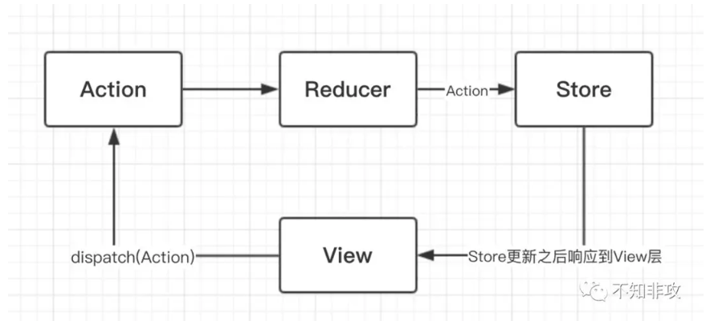

# useReducer
引入
```
import React,{useReducer} from 'react';
```
定义一个状态值，以表示useReducer维护的数据格式
```
const initialState:number = 0;
```
定义一个Reducer,指定状态的改变方式
```
const reducer = (state:number,action:string)=>{
    switch(action){
        case 'increment':return state + 1;
        case 'decrement':return state - 1;
        case 'reset':return 0;
        default:
            return state;
    }
}
```
> Reducer函数接收两个参数，第一个参数是当前的最新状态值，第二参数则用于告诉Reducer当前执行了什么操作。Reducer会根据不同的操作执行不同的逻辑去修改state。

## 使用useReducer
```
export default function Counter(){
    const [counter,dispatch] = useReducer(reducer,initialState);

    return (
        <div style={{width:'200px',margin:'auto'}}>
            <div style={{width:'40px',margin:'100px auto',fontSize:'40px'}}>{counter}</div>
            <Button onClick={()=>dispatch('increment')}>递增</Button>
            <Button onClick={()=>dispatch('decrement')}>递减</Button>
            <Button onClick={()=>dispatch('reset')}>重置</Button>
        </div>
    )
}
```  



### combineReducer方法
将多个Reducer合并为一个  

- 拆分Store
- 拆分Reducer  

```
interface IterationOB{
    [key:string]:any
}

//参数为一个对象，里面有所有的reducer
const combineReducer = (reducers:IterationOB) => {
    //取得所有key
    const reducerKeys = Object.keys(reducers);
    //合并之后的State放在这里
    let objInitState:IterationOB = {};

    //检查每一项是否有默认值
    reducerKeys.forEach((key)=>{
        //传入空的type,获取默认值，这样写了之后，action的类型就只能是{type:'xxx'}这种格式了
        const initState = reducers[key](undefined,{type:''});
        if(initState == 'undefined'){
            throw new Error(`${ey} does not return state.`);
        }
        objInitState[key] = initState;
    })

    return (state:any,action:any)=>{
        if(action){
            reducerKeys.forEach((key)=>{
                const previousState = objInitState[key];
                objInitState[key] = reducers[key](previousState,action);
            })
        }

        return {...objInitState};
    }
}

export default combineReducer;
```

#### 扩展上面的增减案例
首先定义两个初始状态，并且定义好每个状态对应的reducer函数。然后通过我们自己定义的combineReducer方法合并reducer。

```
import combineReducer from './combineReducer';

interface Action {
    type:string,
    payloading:number
}

const stateA:number = 0;

function reducerA(state=stateA,action:Action){
    switch (action.type) {
        case ‘incrementA’: 
            return state + action.payload
        case ‘decrementA’:
            return state - action.payload
        default:
            return state;
    }
}

const stateB:number = 0;

function reducerB(state = stateB, action: Action) {
  switch (action.type) {
    case 'incrementB': 
      return state + action.payload
    case 'decrementB':
      return state - action.payload
    default:
      return state;
  }
}

export default combineReducer({reducerA, reducerB});
```
最后定义函数组件
```
import React,{useReducer} from 'react';
import {Button} from 'antd-mobile';
import reducer from './reducer';

export default function Counter(){
    const [counter,dispatch] = useReducer(reducer,reducer());
    console.log(counter);

    return (
       <div style={{ width: ‘200px’, margin: ‘auto’ }}>
      <div style={{ width: '40px', margin: '100px auto’, fontSize: ‘40px’ }}>{counter.reducerA}</div>
      <Button onClick={() => dispatch({type: 'incrementA', payload: 10})}>递增A</Button>
      <Button onClick={() => dispatch({type: 'decrementA', payload: 10})}>递减A</Button>
      <div style={{ width: '40px', margin: '100px auto', fontSize: ‘40px’ }}>{counter.reducerB}</div>
      <Button onClick={() => dispatch({type: ‘incrementB’, payload: 10})}>递增B</Button>
      <Button onClick={() => dispatch({type: ‘decrementB’, payload: 10})}>递减B</Button>
    </div> 
    );
}
```

### React hooks和redux
#### 使用新的hooks之前
```
import React from 'react';
import {connect} from 'react-redux';
import * as actions from '../actions/actions';

class App extends React.Component{
    constructor(props){
        super(props);
    }

    render(){
        const {count,increment,decrement} = this.props;

        return (
            <div>
                <h1>The count is {count}</h1>
                <button onClick={() => increment(count)}>+</button>
                <button onClick={() => decrement(count)}>-</button>
            </div>
        );
    }
}

const mapStateToProps = store => ({
    count:store.count
});

const mapDispatchToProps = dispatch => ({
    increment:count => dispatch(actions.increment(count)),
    decrement:count => dispatch(actions.decrement(count))
});

export default connect(mapStateToProps,mapDispatchToProps)(App);
```

#### 使用新的hooks之后
```

import React from 'react';
import * as actions from '../actions/actions';
import {useSelector, useDispatch} from 'react-redux';

const App = () => {
  const dispatch = useDispatch();
  const count = useSelector(store => store.count);

  return (
    <div>
      <h1>The count is {count}</h1>
      <button onClick={() => dispatch(actions.increment(count))}>+</button>
      <button onClick={() => dispatch(actions.decrement(count))}>-</button>
    </div>
  );
}

export default App;
```