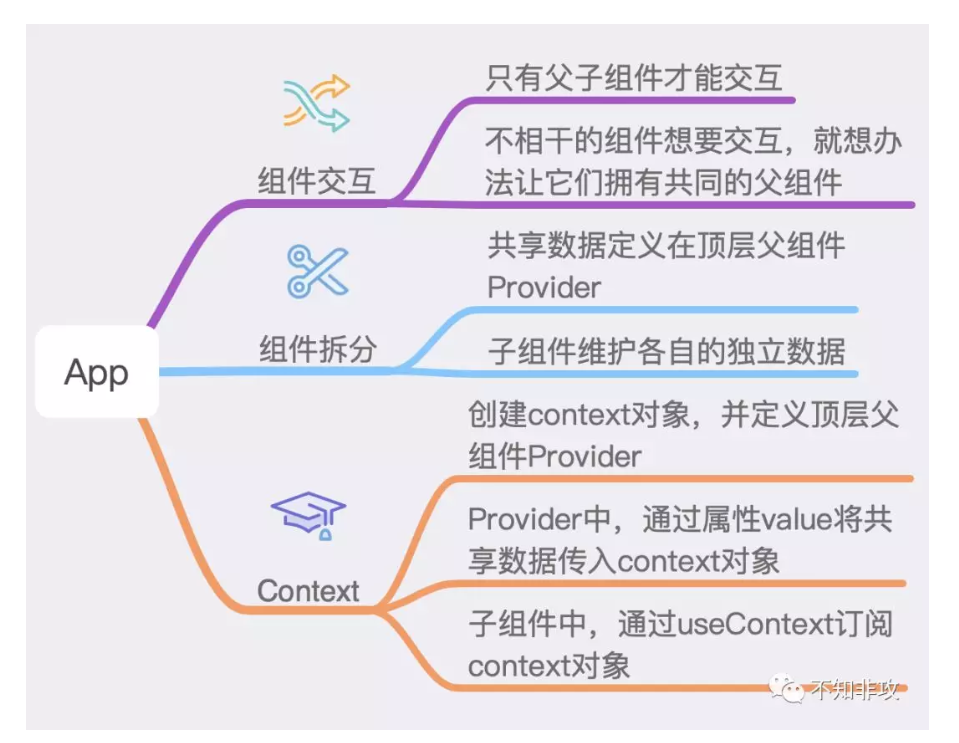
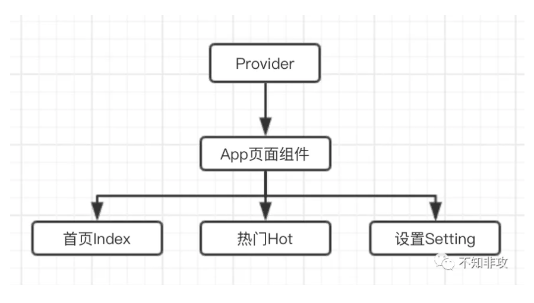

# useContext
  

  

**在顶层组件Provider中，只关心被不同组件共享的数据**

## 创建顶层组件Provider
```
import React,{createContext,useState,Dispatch,ReactNode} from 'react';

interface Injected{
    unreadIndex:number,
    setUnreadIndex:Dispatch<any>,
    unreadHot:number,
    setUnreadHot:Dispatch<any>,
}

export const ctx = createContext<Injected>({} as Injected);

interface Props{
    children?:ReactNode
}

export function Provider({children}:Props){
    const [unreadIndex,setUnreadIndex] = useState(0);
    const [unreadHot,setUnreadHot] = useState(0);

    const value = {
        unreadIndex,
        setUnreadIndex,
        unreadHot,
        setUnreadHot,
    }

    return (
        <ctx.Provider value={value}>{children}</ctx.Provider>
    )
}
```
创建页面组件App，该组件会引入三个Tab页组件，并实现tab切换功能。还需要显示未读的状态。

```
import React, {useContext, useState} from 'react';
import {ctx, Provider} from './context';
import {Badge} from 'antd-mobile';
import Home from './components/Home';
import Hot from './components/Hot';
import Setting from './components/Setting';
import './index.scss';

function App() {
  const {unreadIndex, unreadHot} = useContext(ctx);
  const [tabIndex, setTabindex] = useState(0);

  return (
    <div className="use_context_container">
      <div className="tab_wrapper">
        <Badge text={unreadIndex} style={{ marginLeft: 42 }}>
          <div onClick={() => setTabindex(0)}>首页</div>
        </Badge>

        <Badge text={unreadHot} style={{ marginLeft: 42 }}>
          <div onClick={() => setTabindex(1)}>热门</div>
        </Badge>

        <div onClick={() => setTabindex(2)}>设置</div>
      </div>

      <div className="content_wrapper">
        {tabIndex === 0 && (
          <Home />
        )}

        {tabIndex === 1 && (
          <Hot />
        )}

        {tabIndex === 2 && (
          <Setting />
        )}
      </div>
    </div>
  )
}

export default () => (
  <Provider>
    <App />
  </Provider>
)
```
Home组件通过知乎日报的接口请求到数据，并展示出来。除此之外，还需要重置Home的未读数字。因此需要借助useContext来访问setUnreadIndex，将对应的状态重置。

```

import React, { useState, useEffect, useContext } from 'react';
import {zhLastFeedApi, Feed} from './api';
import { ActivityIndicator, Carousel } from 'antd-mobile';
import {ctx} from '../../context';
import './style.scss';

// 执行如下指令，禁用chrome跨域限制
// open -a "Google Chrome" --args --disable-web-security  --user-data-dir

export default function ZhihuFeed() {
  const [feed, setFeed] = useState<Feed>();
  const {setUnreadIndex} = useContext(ctx);

  useEffect(() => {
    setUnreadIndex(0);
    zhLastFeedApi().then(res => {
      setFeed(res);
    });
  }, []);

  if (!feed) {
    return <div className="feed_container loading"><ActivityIndicator /></div>
  }

  const {stories, top_stories} = feed;

  return (
    <div className="feed_container">
      <Carousel infinite autoplay dots={false}>
        {top_stories.map((item, i) => (
          <a className="top_feed_item" key={i} href={item.url} style={{backgroundImage: `url(${item.image})`}}>
            <div className="title">{item.title}</div>
          </a>
        ))}
      </Carousel>

      <div className="inner">
        {stories.map((item, i) => (
          <a className="feed_item" href={item.url} key={i}>
            
            <div className="info">
              <div className="title">{item.title}</div>
              <div className="tip">{item.hint}</div>
            </div>
          </a>
        ))}
      </div>
    </div>
  )
}
```
Hot组件与Home组件逻辑几乎一样，访问博客园的接口并展示数据。

```

import React, { useState, useEffect, useContext } from 'react';
import {topViewApi} from './api';
import { ActivityIndicator } from 'antd-mobile';
import { ctx } from '../../context';
import './style.scss';
// 执行如下指令，禁用chrome跨域限制
// open -a "Google Chrome" --args --disable-web-security  --user-data-dir

export default function ZhihuFeed() {
  const [feed, setFeed] = useState<string>();
  const {setUnreadHot} = useContext(ctx);

  useEffect(() => {
    setUnreadHot(0);
    topViewApi().then(res => {
      setFeed(res);
    })
  }, []);

  if (!feed) {
    return <div className="feed_container loading"><ActivityIndicator /></div>
  }

  return (
    <div className="blog_container" dangerouslySetInnerHTML={{__html: feed}}>
    </div>
  )
}
```