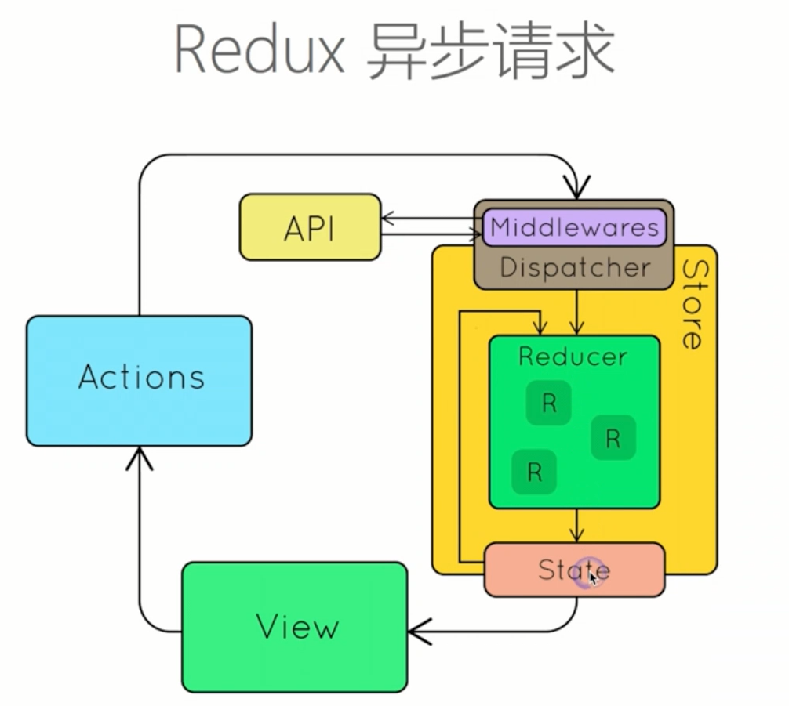

# 中间件（Middleware）
中间件就是一个函数，对store.dispatch方法进行了改造，在发出Action和执行Reducer这两步之间，添加了其他功能。**使用applyMiddleware方法接入中间件**
- 1.截获action
- 2.发出action

## 中间件的使用
**applyMiddle的参数顺序有严格要求，logger中间件必须放在所有中间件链的最后**
### redux-logger中间件
```
import {applyMiddleware,createStore} from 'redux';
//引入中间件
import createLogger from 'redux-logger';
const logger = createLogger();

//利用applyMiddleware和createStore接入中间件
const store = createStore(
    reducer,
    applyMiddleware(logger)
);
```
redux-logger提供一个生成器createLogger，可以生成日志中间件logger。然后，将它放在applyMiddleware方法之中，传入createStore方法，就完成了store.dispatch()的功能增强。

### redux-thunk中间件
使我们可以控制dispatch响应action的时机
```
import {applyMiddleware,createStore} from 'redux';

import thunk from 'redux-thunk';

const store = createStore(
  reducer,
  applyMiddleware(thunk)
);

//发送一个异步action
store.dispatch(fetchNewBook('learnRedux'));

//在函数体内进行异步操作
//在异步完成后再派发相应的action
//也就是说把发请求等异步操作集成到action的相关函数中
function fetchNewBook(book){
  return function(dispatch){
    dispatch({
      type:'ZZ',
      data:book
    })
    ajax({
      url:`/some/API/${book}.json`,
      type:'POST',
      data:{}
    }).then((bookData)=>{
      dispatch({
        type:'JOJO',
        data:bookData
      })
    })
  }
}
```

# 异步操作
  
  
  Action发出以后，过一段时间再执行Reducer，这就是异步。  
  同步操作只要发出一种Action即可，异步操作的差别是它要发出三种Action。  
  - 操作发起时的Action
  - 操作成功时的Action
  - 操作失败时的Action

异步操作的思路如下：
- 操作开始时，送出一个Action，触发State更新为“正在操作”状态，View重新渲染
- 操作结束时，再送出一个Action,触发State更新为“操作结束”状态，View再一次重新渲染。