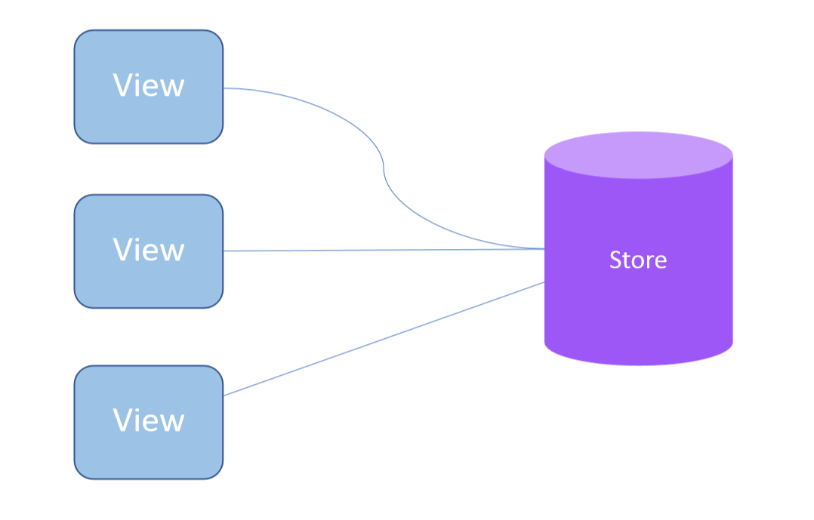

# Redux基本原则
- 唯一数据源
- 保持状态只读
- 数据改变只能通过纯函数完成

1. 唯一数据源  
   唯一数据源指的是应用的状态数据应该只存储在唯一的一个Store中，即所有的组件的数据源就是这个Store上的状态。  
   
2. 保持状态只读  
   不能去直接修改状态，要修改Store的状态,必须要通过派发一个action对象完成。
3. 数据改变只能通过纯函数完成  
   纯函数指的是Reducer，通过reducer函数完成规约所有元素的功能。
   ```
   reducer(state,action)
   ```
   第一个参数state是当前的状态，第二个参数action是接收到的action对象，而reducer函数要做的事情，就是根据state和action的值产生一个新的对象返回。
   ```
   function todos(state=[],action){
       switch(action.type){
           case 'ADD_TODO':
           return state.concat([{text:action.text,completed:false}])
           case 'TOGGLE_TODO':
           return state.map(
               (todo,index)=>action.index===index ? {text:todo.text,completed:!todo.completed : todo}
           )
           default:
           return state
       }
   }
   ```