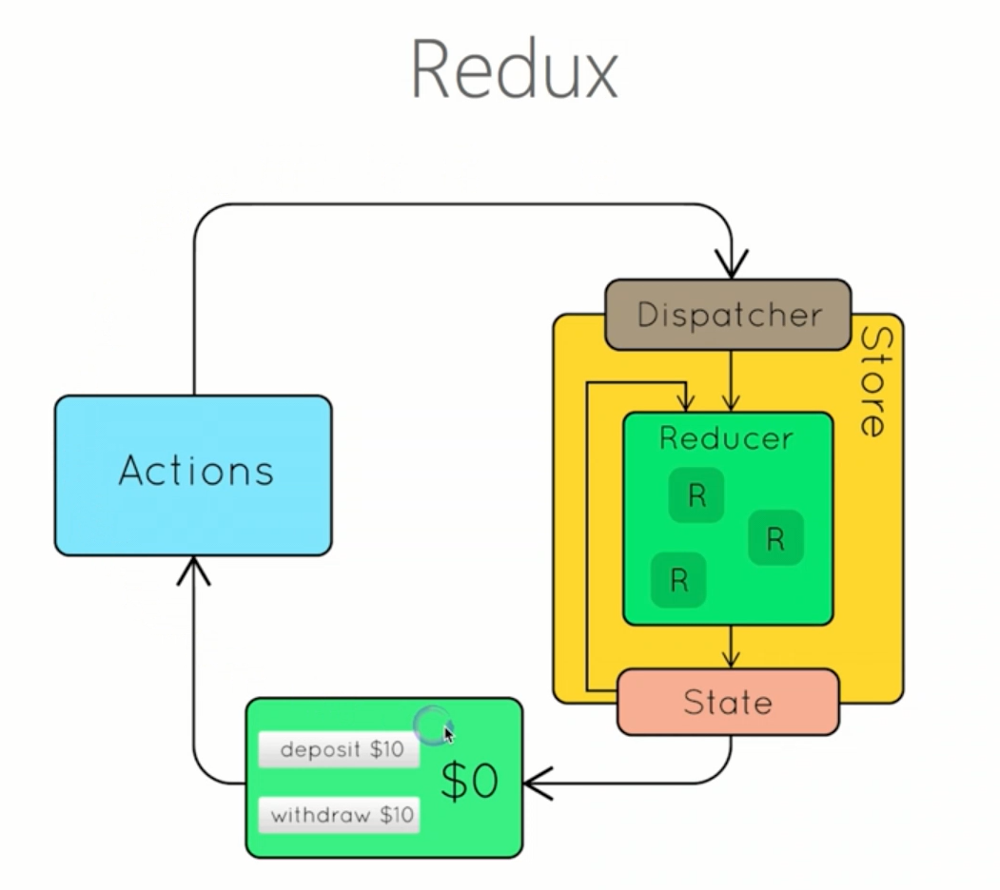

# Redux基础
Redux是JavaScript状态容器，提供可预测化的状态管理。  
  
## store
store是redux应用的唯一数据源，调用createStore API创建store。  
```
import { createStore } from 'redux';
const store = createStore(fn);
```
Store具有以下职责：
- 维持应用的state
- 提供getState()方法获取state
- 提供dispatch(action)方法更新state
- 通过subscribe(listener)注册监听器
- 通过subscribe(listener)返回的函数注销监听器
  
**Redux 应用只有一个单一的store**。当需要拆分数据处理逻辑时，应该使用reducer组合而不是创建多个store。
## action
action是修改store的唯一途径，通过store.dispath()将action传到store  
本质上就是一个普通js对象。action内必须使用一个字符串类型的type字段来表示将要执行的动作。
```
  const action = {
      type:ADD_TODO,
      payload:'Learn Redux'
  }
```
以上的代码中，Action的名称是ADD_TODO,它携带的信息是字符串Learn Redux。
### Action Creator
View要发送多少种消息，就会有多少种Action。可以定义一个函数来生成Action,这个函数就叫做Action Creator
```
const ADD_TODO = '添加TODO';

function addTodo(text){
    return {
        type:ADD_TODO,
        text
    }
}

const action = addTodo('Learn Redux');
```
上面代码中，addTodo函数就是一个Action Creator