# 架构设计与首屏渲染
## schedule + render + commit = React
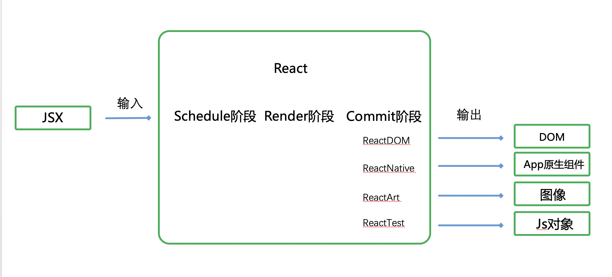  

- JSX在编译时会被Babel转换成**React.createElement**方法  
```
// 输入JSX
const a = <div>Hello</div>

// 在编译时，被babel编译为React.createElement函数
const a = React.createElement('div', null, 'Hello');

// 在运行时，执行函数，返回描述组件结构的对象
const a = {
  $$typeof: Symbol(react.element),
  "type": "div",
  "key": null,
  "props": {
    "children": "Hello"
  }
}
```

1. schedule阶段：当触发状态改变后，schedule阶段判断触发的更新的优先级，通知render阶段接下去应该处理哪个更新
2. render阶段：收到schedule阶段的通知，处理更新对应的JSX,决定哪些JSX对象是需要最终被渲染的
3. commit阶段：将render阶段整理出的需要被渲染的内容渲染到页面上  

- ReactDOM：渲染到浏览器
- ReactNative：渲染App原生组件
- ReactTest：渲染出纯JS对象用于测试
- ReactArt：渲染到Canvas、SVG或VML

## render的最小单元 --- Fiber

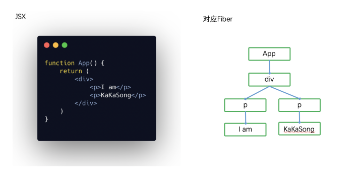  

- Fiber中可以保存节点的类型
- 可以保存节点的信息(state、props等)
- 可以保存节点对应的值
- 可以保存节点的行为(更新/删除/插入)  

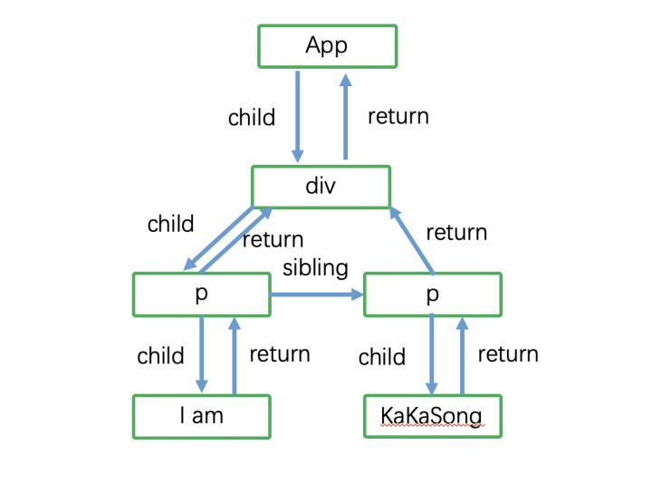  

- child：指向第一个子Fiber
- sibling：指向右边的兄弟节点
- return：指向自己的父节点

## render和commit的整体流程
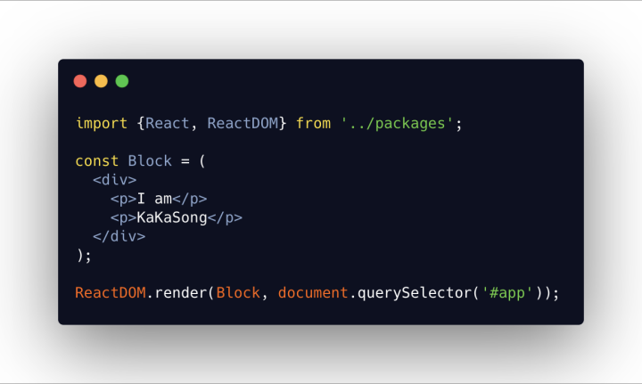  

### render阶段
#### 1. 向下遍历JSX,为每个JSX节点生成对应的Fiber，并赋值    

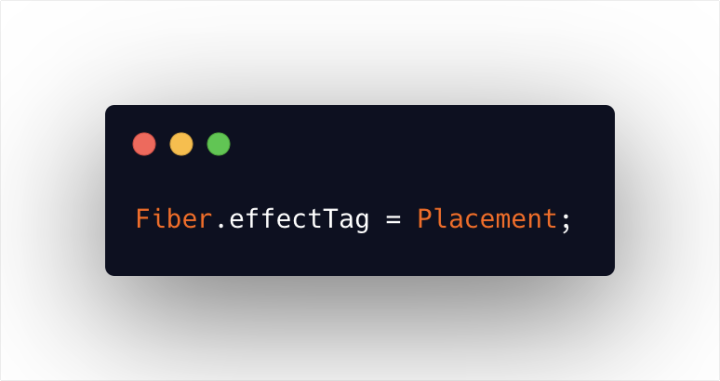  

**effectTag**字段表示当前**Fiber**需要执行的副作用  
- Placement插入DOM节点
- Update更新DOM节点
- Deletion删除DOM节点  

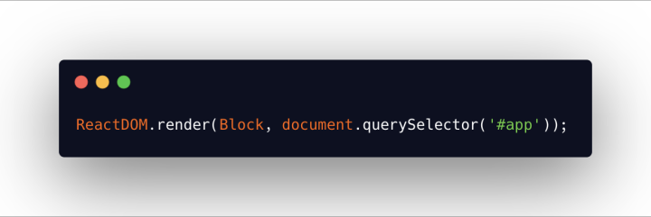  

执行这行初始化的代码首先会创建一个根Fiber节点，所以当从根Fiber向下创建Fiber时，我们始终是为子节点创建Fiber。

#### 2.为每个Fiber生成对应的DOM节点，保存在Fiber.stateNode
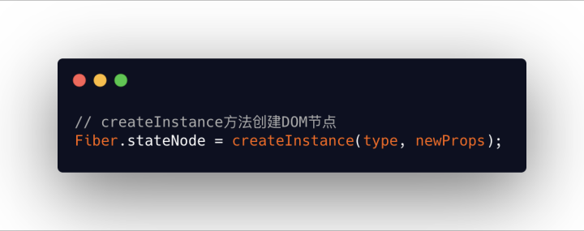  

Commit阶段只需要遍历所有有Placement副作用的Fiber，依次执行DOM插入操作就完成了首屏的渲染。


## 深入render阶段
### beginWork
> 向下遍历JSX，为每个JSX节点的子JSX节点生成对应的Fiber，并设置effectTag

### completeWork
> 为每个Fiber生成对应的DOM节点  

通过**workInProgress**这个全局变量表示当前**render**阶段正在处理的Fiber，当首屏渲染初始化时， workInProgress === 根Fiber。

调用**workLoopSync**方法，他内部会循环调用**performUnitOfWork**方法。  

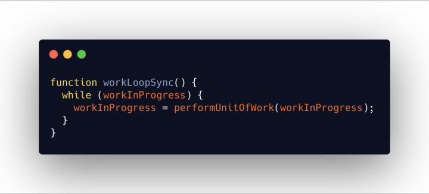  

**performUnitOfWork**每次接收一个Fiber，调用beginWork或CompleteWork，处理完该Fiber后返回下一个需要处理的Fiber。  

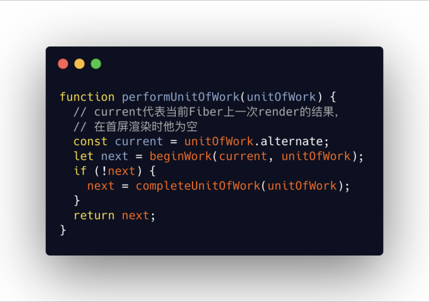  

当performUnitOfWork返回null时，就代表所有节点的render阶段结束了。  

1. 采用深度优先遍历，从上往下生成子Fiber，生成后继续向子Fiber遍历
2. 当遍历到底没有子Fiber时，开始从底往上遍历，为每个步骤1中已经创建的Fiber创建对应的DOM节点  

## 优化渲染阶段
### effectList
在render阶段就提前标记好哪些Fiber会被设置Fiber.effectTag  

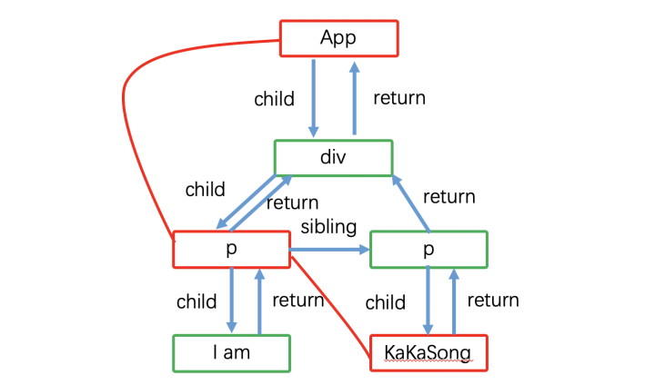  

标红的Fiber代表本次调度该Fiber有effectTag，我们用链表的指针将他们链接起来形成一条单向链表，这条链表就是 effectList。  

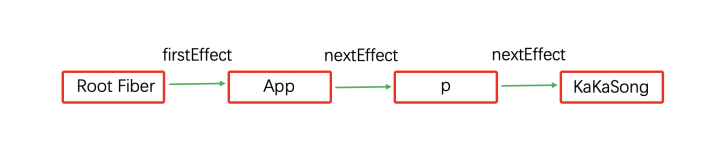  

### 首屏渲染的特别之处
在render阶段执行completeWork创建Fiber对应的DOM节点时，我们遍历一下这个Fiber节点的所有子节点，将子节点的DOM节点插入到创建的DOM节点下。  

子Fiber的completeWork会先于父Fiber执行，所以当执行到父Fiber时，子Fiber一定存在对应的DOM节点  

这样当遍历到根Fiber节点时，我们已经有一棵构建好的离屏DOM树，这时候我们只需要赋值根节点的effectTag就能在commit阶段一次性将整课DOM树挂载。  

```
// 仅赋值根fiber一个节点effectTag
RootFiber.effectTag = Placement; 
```