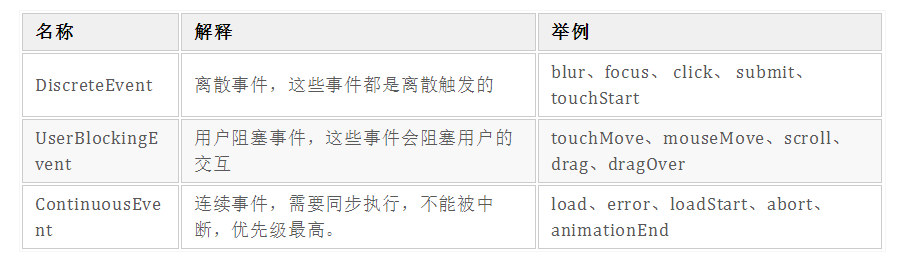
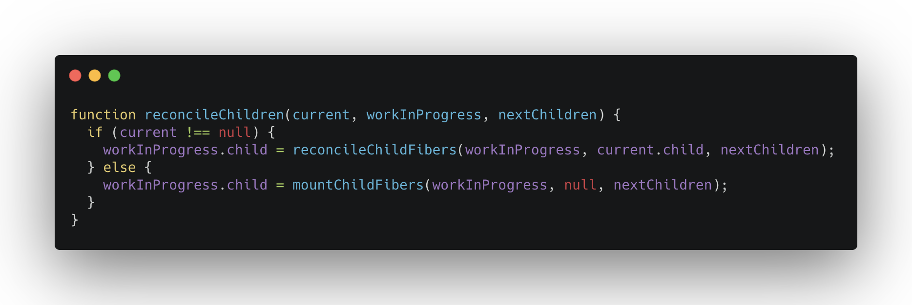

# 组件更新
## 非首屏渲染
### schedule阶段的不同
在非首屏渲染中，更新一般是通过用户触发了事件来产生。  

  

不同的事件被赋予了不同的优先级，不同的优先级对应了不同的延迟时间。  

```
// 不同的优先级
var NoPriority = 0;
var ImmediatePriority = 1;
var UserBlockingPriority = 2;
var NormalPriority = 3;
var LowPriority = 4;
var IdlePriority = 5;

// 不同优先级对应的延迟时间
var maxSigned31BitInt = 1073741823; // Times out immediately
var IMMEDIATE_PRIORITY_TIMEOUT = -1; // Eventually times out
var USER_BLOCKING_PRIORITY = 250;
var NORMAL_PRIORITY_TIMEOUT = 5000;
var LOW_PRIORITY_TIMEOUT = 10000; // Never times out
var IDLE_PRIORITY = maxSigned31BitInt; // Tasks are stored on a min heap

```

更新会被赋予一个任务过期时间   

> 过期时间 = 当前时间 + 一个延迟时间  

```
// 更新的计算公式
fiber.expirationTime = currentTime + timeout;

// 更新1的过期时间
fiber.expirationTime = currentTime - 1;
// 更新2的过期时间
fiber.expirationTime = currentTime + 5000;

```
更新1的过期时间小于当前时间，代表这个更新已经过期，需要立即执行。而更新2的过期时间在当前时间的基础上还要过5000个时间单位才会过期。  

**如何调度优先级**  
- 不同类型事件产生不同优先级更新
- 不同优先级更新对应不同过期时间
- 过期任务会被优先处理  

### render阶段的不同
#### beginWork的不同
```
//根据fiber的类型进入不同的更新函数
function beginWork(current, workInProgress) {
  switch (workInProgress.tag) {
    // 省略...
    case HostRoot:  
      // 省略...
    case FunctionComponent:
      const Component = workInProgress.type;
      return updateFunctionComponent(
        current,
        workInProgress,
        Component,
        workInProgress.pendingProps
      );
    case ClassComponent:
        return updateClassComponent(current, workInProgress, ...);
    case HostComponent:
      // 省略...
    case HostText:
        // 省略...
  }
}

```

```
function Counter() {
    const [count, updateCount] = useState(0);
    
    return <div onClick={() => updateCount(count + 1)}>{count}</div>
}

```
- 作为函数组件，会进入updateFunctionComponent方法  

```
function updateFunctionComponent(current, workInProgress, Component, nextProps) {
    //nextChildren指本次更新的JSX对象
    //workInProgress指正在“work”过程中的fiber节点，"work"指render阶段和commit阶段
    //current指当前页面上显示的DOM对应的fiber节点，即已经“work”完毕的fiber。
  let nextChildren = renderWithHooks(current, workInProgress, Component, nextProps);
  // 省略...
  reconcileChildren(current, workInProgress, nextChildren);
  return workInProgress.child;
}

```

```
renderWithHooks(current, workInProgress, Component, props) {
  // ...省略
  const children = Component(props);  
  
  // ...省略
  return children;
}

```
- current指当前页面上显示的DOM对应的fiber节点，即已经“work”完毕的fiber。  


**通过current === null ?来判断本次更新是否是首屏渲染**  

```
workInProgress.alternate === current;
current.alternate === workInProgress;

```
- 首屏渲染：current === null，通过nextChildrenJSX对象保存的数据创建workInProgress fiber
- 非首屏渲染：前一次更新的workInProgress fiber变为current fiber，比较current与nextChildrenJSX对象，创建本次更新的workInProgress fiber。  

  

### commit阶段的不同
1. schedule阶段决定更新的优先级
2. 高优先级的更新进入render阶段，执行beginWork，内部会执行reconcile，标记fiber的Placement、Deletion,创建workInProgress fiber
3. 执行completeWork，对比props,有变化就标记Update  

