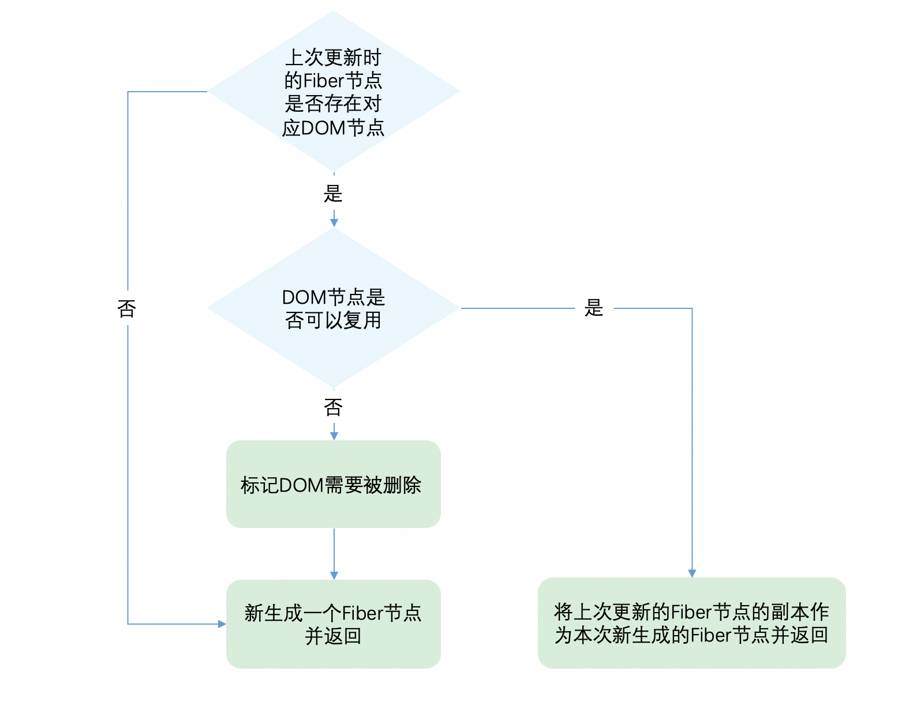

# Diff算法
> 将上次更新的结果与本次更新的值比较，只将变化的部分体现在DOM上  

为了降低算法复杂度，React的diff会预设三个限制：  
1. 只对同级元素进行Diff,如果一个DOM节点在前后两次更新中跨越了层级，那么React不会尝试复用他
2. 两个不同类型的元素会产生出不同的树，如果元素由div变成p,React会销毁div及其子孙节点，并新建p及其子孙节点
3. 开发者可以通过key属性来暗示哪些子元素在不同的渲染下能保持稳定  

```
// 更新前
<div>
    <p key="ka">ka</p>
    <h3 key="song">song</h3>
</div>

// 更新后
<div>
    <h3 key="song">song</h3>
    <p key="ka">ka</p>
</div>


```
如果没有key，React会认为div的第一个子节点由p变为h3，第二个子节点由h3变为p。这符合限制2的设定，会销毁并新建。  
但是当我们用key指明了节点前后对应关系后，React知道key === "ka"的p在更新后还存在，所以DOM节点可以复用，只是需要交换下顺序。

## Diff是如何实现的
### Diff函数入口简介
```
// 根据newChild类型选择不同diff函数处理
function reconcileChildFibers(
  returnFiber: Fiber,
  currentFirstChild: Fiber | null,
  newChild: any,
): Fiber | null {

  const isObject = typeof newChild === 'object' && newChild !== null;

  if (isObject) {
    // object类型，可能是 REACT_ELEMENT_TYPE 或 REACT_PORTAL_TYPE
    switch (newChild.$typeof) {
      case REACT_ELEMENT_TYPE:
        // 调用 reconcileSingleElement 处理
      // ...其他case
    }
  }

  if (typeof newChild === 'string' || typeof newChild === 'number') {
    // 调用 reconcileSingleTextNode 处理
  }

  if (isArray(newChild)) {
    // 调用 reconcileChildrenArray 处理
  }

  // 一些其他情况调用处理函数

  // 以上都没有命中，删除节点
  return deleteRemainingChildren(returnFiber, currentFirstChild);
}

```
- newChild：本次更新的JSX对象  

1. 类型为object、number、string，代表同级只有一个节点
2. 类型为Array,同级有多个节点    

#### 1. 同级只有一个节点的Diff
```
  const isObject = typeof newChild === 'object' && newChild !== null;

  if (isObject) {
    // 对象类型，可能是 REACT_ELEMENT_TYPE 或 REACT_PORTAL_TYPE
    switch (newChild.$typeof) {
      case REACT_ELEMENT_TYPE:
        // 调用 reconcileSingleElement 处理
      // ...其他case
    }
  }

```  



#### 判断DOM节点是否可以复用
```
function reconcileSingleElement(
  returnFiber: Fiber,
  currentFirstChild: Fiber | null,
  element: ReactElement
): Fiber {
  const key = element.key;
  let child = currentFirstChild;
  
  // 首先判断是否存在对应DOM节点
  while (child !== null) {
    // 上一次更新存在DOM节点，接下来判断是否可复用
    if (child.key === key) {
    
    // 🙋‍♂️同学看这里，首先比较key是否相同
      switch (child.tag) {
        // ...省略case
        
        default: {
          if (child.elementType === element.type) {
            // 🙋‍♂️同学看这里，key相同后再看type是否相同
            // 如果相同则表示可以复用
            return existing;
          }
          
          // type不同则跳出循环
          break;
        }
      }
      // 👹 key不同或type不同都代表不能复用，会到这里
      // 不能复用的节点，被标记为删除
      deleteRemainingChildren(returnFiber, child);
      break;
    } else {
      deleteChild(returnFiber, child);
    }
    child = child.sibling;
  }

  // 创建新Fiber，并返回
}

```
> React通过判断key是否相同，如果key相同则判断type是否相同，只有都相同时一个DOM节点才能复用  

#### 2.同级有多个元素的Diff
```
function List () {
    return (
        <ul>
            <li key="0">0</li>
            <li key="1">1</li>
            <li key="2">2</li>
            <li key="3">3</li>
        </ul>
    )
}

```

```
  if (isArray(newChild)) {
    // 调用 reconcileChildrenArray 处理
  }

```

- 情况1节点更新  

```
// 情况1 节点更新

// 之前
<ul>
    <li key="0" className="before">0<li>
    <li key="1">1<li>
</ul>

// 之后情况1 节点属性变化
<ul>
    <li key="0" className="after">0<li>
    <li key="1">1<li>
</ul>

// 之后情况2 节点类型更新
<ul>
    <div key="0">0<li>
    <li key="1">1<li>
</ul>

```
- 情况2 节点新增或减少

```
// 情况2 节点新增或减少

// 之前
<ul>
    <li key="0">0<li>
    <li key="1">1<li>
</ul>

// 之后情况1 新增节点
<ul>
    <li key="0">0<li>
    <li key="1">1<li>
    <li key="2">2<li>
</ul>

// 之后情况2 删除节点
<ul>
    <li key="1">1<li>
</ul>

```
- 情况3 节点位置变化

```
// 情况3 节点位置变化

// 之前
<ul>
    <li key="0">0<li>
    <li key="1">1<li>
</ul>

// 之后
<ul>
    <li key="1">1<li>
    <li key="0">0<li>
</ul>

```
更新的JSX对象newChildren为数组形式，但是和newChildren中每个值进行比较的是上次更新的Fiber节点，Fiber节点的同级节点是由sibling指针链接形成的链表。  

即 newChildren[0]与oldFiber比较，newChildren[1]与oldFiber.sibling比较。  

单链表无法使用双指针，所以无法对算法使用双指针优化。

#### Diff算法的整体逻辑会经历两轮遍历
1. 处理更新的节点
2. 处理剩下的不属于更新的节点。  

```

// 之前
abcd

// 之后
acdb

===第一轮遍历开始===
a（之后）vs a（之前）  
key不变，可复用
此时 a 对应的oldFiber（之前的a）在之前的数组（abcd）中索引为0
所以 lastPlacedIndex = 0;

继续第一轮遍历...

c（之后）vs b（之前）  
key改变，不能复用，跳出第一轮遍历
此时 lastPlacedIndex === 0;
===第一轮遍历结束===

===第二轮遍历开始===
newChildren === cdb，没用完，不需要执行删除旧节点
oldFiber === bcd，没用完，不需要执行插入新节点

将剩余oldFiber（bcd）保存为map

// 当前oldFiber：bcd
// 当前newChildren：cdb

继续遍历剩余newChildren

key === c 在 oldFiber中存在
const oldIndex = c（之前）.index;
即 oldIndex 代表当前可复用节点（c）在上一次更新时的位置索引
此时 oldIndex === 2;  // 之前节点为 abcd，所以c.index === 2
比较 oldIndex 与 lastPlacedIndex;

如果 oldIndex >= lastPlacedIndex 代表该可复用节点不需要移动
并将 lastPlacedIndex = oldIndex;
如果 oldIndex < lastplacedIndex 该可复用节点之前插入的位置索引小于这次更新需要插入的位置索引，代表该节点需要向右移动

在例子中，oldIndex 2 > lastPlacedIndex 0，
则 lastPlacedIndex = 2;
c节点位置不变

继续遍历剩余newChildren

// 当前oldFiber：bd
// 当前newChildren：db

key === d 在 oldFiber中存在
const oldIndex = d（之前）.index;
oldIndex 3 > lastPlacedIndex 2 // 之前节点为 abcd，所以d.index === 3
则 lastPlacedIndex = 3;
d节点位置不变

继续遍历剩余newChildren

// 当前oldFiber：b
// 当前newChildren：b

key === b 在 oldFiber中存在
const oldIndex = b（之前）.index;
oldIndex 1 < lastPlacedIndex 3 // 之前节点为 abcd，所以b.index === 1
则 b节点需要向右移动
===第二轮遍历结束===

最终acd 3个节点都没有移动，b节点被标记为移动


```

```
// 之前
abcd

// 之后
dabc

===第一轮遍历开始===
d（之后）vs a（之前）  
key不变，type改变，不能复用，跳出遍历
===第一轮遍历结束===

===第二轮遍历开始===
newChildren === dabc，没用完，不需要执行删除旧节点
oldFiber === abcd，没用完，不需要执行插入新节点

将剩余oldFiber（abcd）保存为map

继续遍历剩余newChildren

// 当前oldFiber：abcd
// 当前newChildren dabc

key === d 在 oldFiber中存在
const oldIndex = d（之前）.index;
此时 oldIndex === 3; // 之前节点为 abcd，所以d.index === 3
比较 oldIndex 与 lastPlacedIndex;
oldIndex 3 > lastPlacedIndex 0
则 lastPlacedIndex = 3;
d节点位置不变

继续遍历剩余newChildren

// 当前oldFiber：abc
// 当前newChildren abc

key === a 在 oldFiber中存在
const oldIndex = a（之前）.index; // 之前节点为 abcd，所以a.index === 0
此时 oldIndex === 0;
比较 oldIndex 与 lastPlacedIndex;
oldIndex 0 < lastPlacedIndex 3
则 a节点需要向右移动

继续遍历剩余newChildren

// 当前oldFiber：bc
// 当前newChildren bc

key === b 在 oldFiber中存在
const oldIndex = b（之前）.index; // 之前节点为 abcd，所以b.index === 1
此时 oldIndex === 1;
比较 oldIndex 与 lastPlacedIndex;
oldIndex 1 < lastPlacedIndex 3
则 b节点需要向右移动

继续遍历剩余newChildren

// 当前oldFiber：c
// 当前newChildren c

key === c 在 oldFiber中存在
const oldIndex = c（之前）.index; // 之前节点为 abcd，所以c.index === 2
此时 oldIndex === 2;
比较 oldIndex 与 lastPlacedIndex;
oldIndex 2 < lastPlacedIndex 3
则 c节点需要向右移动

===第二轮遍历结束===


```