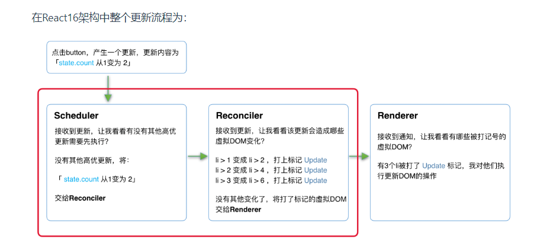

# 1.React理念
- 速度快
- 响应自然

## 速度快
```
<template>
    <ul>
        <li>0</li>
        <li>{{ name }}</li>
        <li>2</li>
        <li>3</li>
    </ul>
</template>
```

```
<ul>{
    data.map((name, i) => <li>{i !== 1 ? i : name}</li>)
}</ul>
```
由于语法的灵活，在编译时无法区分可能变化的部分。所以在运行时，React需要遍历每个li，判断其数据是否更新。  

- 使用**PureComponent**或**React.memo**构建组件
- 使用**shouldComponentUpdate**生命周期钩子
- 渲染列表时使用**key**
- 使用**useCallback**和**useMemo**缓存函数和变量

## 响应自然
只要组件的更新操作是同步的，那么当更新开始直到渲染完毕前，组件中总会有一定数量的工作占用线程，浏览器没有空闲时间绘制UI，造成卡顿。  

为了体验上的自然，需要将**同步的更新**变为**可中断的异步更新**。  

在浏览器每一帧的时间中，预留一些时间给JS线程，React利用这部分时间更新组件。

当预留的时间不够用时，React将线程控制权交还给浏览器使其有时间渲染UI，React则等待下一帧时间到来继续被中断的工作。

# 2.React架构
- Scheduler(调度器)：调度任务的优先级，高任务优先进入Reconciler
- Reconciler(协调器)：负责找出变化的组件
- Renderer(渲染器)：负责将变化的组件渲染到页面上



# 3.JSX
JSX在编译时会被Babel编译成**React.createElement**方法  

## JSX与虚拟DOM
JSX是一种描述当前组件内容的数据结构，他并不能描述组件schedule、reconcile、render相关的信息。比如如下信息就不包括在JSX中：  

- 组件在更新中的优先级
- 组件的state
- 组件被打上的用于Renderer的标记  

这些内容包含在虚拟DOM中  

在组件mount时，Reconciler根据JSX描述的组件内容生成组件对应的虚拟DOM。在update时，Reconciler将JSX与虚拟DOM保存的数据对比，为对比后状态有变化的虚拟DOM打上标记。
