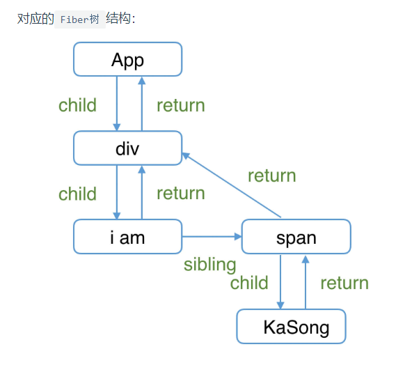
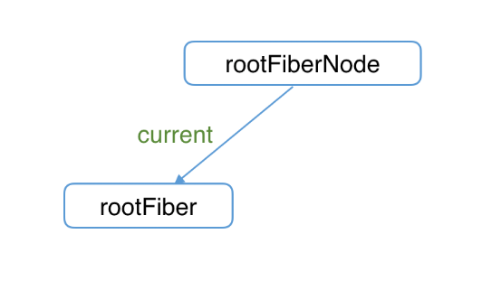
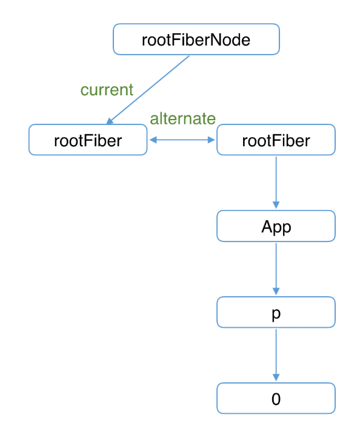
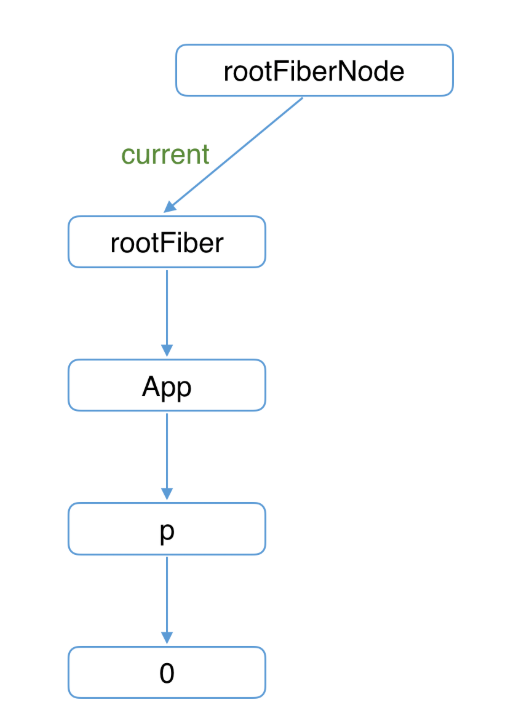
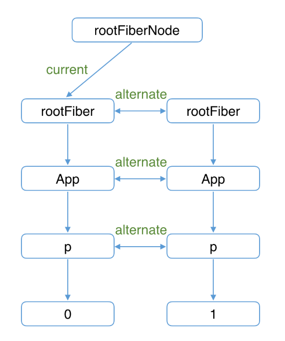
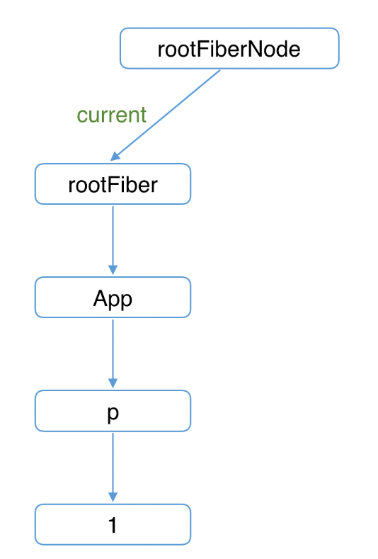
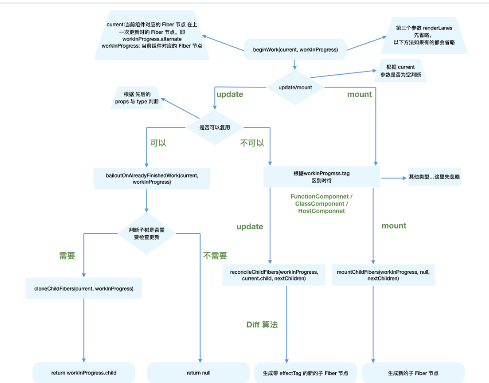

# Render阶段
## 1.Fiber架构
> 在React15及以前，Reconciler采用递归的方式创建虚拟DOM，递归过程是不能中断的。如果组件树的层级很深，递归会占用线程很多时间，造成卡顿。  
> 为了解决这个问题，React16将**递归的无法中断的更新**重构为**异步的可中断更新**---**Fiber**  

### Fiber的含义
1. 作为架构：Reconciler(协调器)基于Fiber节点实现，被称为**Fiber Reconciler**
2. 作为静态的数据结构：每个Fiber节点对应一个**组件**，保存了该组件的**类型**(函数组件/类组件/原生组件...)、对应的DOM节点等信息
3. 作为动态的工作单元：保存了本次更新中该组件**改变的状态**、**要执行的工作**(删除、插入、更新)  

```
function FiberNode(
  tag: WorkTag,
  pendingProps: mixed,
  key: null | string,
  mode: TypeOfMode,
) {
  // 作为静态数据结构的属性
  this.tag = tag;
  this.key = key;
  this.elementType = null;
  this.type = null;
  this.stateNode = null;

  // 用于连接其他Fiber节点形成Fiber树
  this.return = null;
  this.child = null;
  this.sibling = null;
  this.index = 0;

  this.ref = null;

  // 作为动态的工作单元的属性
  this.pendingProps = pendingProps;
  this.memoizedProps = null;
  this.updateQueue = null;
  this.memoizedState = null;
  this.dependencies = null;

  this.mode = mode;

  this.effectTag = NoEffect;
  this.nextEffect = null;

  this.firstEffect = null;
  this.lastEffect = null;

  // 调度优先级相关
  this.lanes = NoLanes;
  this.childLanes = NoLanes;

  // 指向该fiber在另一次更新时对应的fiber
  this.alternate = null;
}
```

### 作为架构
```
// 指向父级Fiber节点
this.return = null;
// 指向子Fiber节点
this.child = null;
// 指向右边第一个兄弟Fiber节点
this.sibling = null;
```

```
function App() {
  return (
    <div>
      i am
      <span>KaSong</span>
    </div>
  )
}
```



### 作为静态的数据结构
```
// Fiber对应组件的类型 Function/Class/Host...
this.tag = tag;
// key属性
this.key = key;
// 大部分情况同type，某些情况不同，比如FunctionComponent使用React.memo包裹
this.elementType = null;
// 对于 FunctionComponent，指函数本身，对于ClassCompoent，指class，对于HostComponent，指DOM节点tagName
this.type = null;
// Fiber对应的真实DOM节点
this.stateNode = null;
```

## 2.双缓存机制
**在内存中构建并直接替换的技术**  

### 双缓存Fiber树
- current Fiber树：当前屏幕显示内容
- workInProgress Fiber树：正在内存中构建的Fiber树  

通过**alternate属性**连接

```
currentFiber.alternate === workInProgressFiber;
workInProgressFiber.alternate === currentFiber;
```

React应用的根节点通过**current指针**在不同**Fiber树**的**rootFiber**间切换来实现Fiber树的切换  

当workInProgress Fiber树构建完成交给Renderer渲染在页面上后，应用根节点的current指针指向workInProgress Fiber树，此时workInProgress Fiber树就变为current Fiber树。  


```
function App() {
  const [num, add] = useState(0);
  return (
    <p onClick={() => add(num + 1)}>{num}</p>
  )
}

ReactDOM.render(<App/>, document.getElementById('root'));
```
### mount阶段

  

1. 首次执行时**ReactDOM.render**会创建**rootFiberNode**和**rootFiber**  

- rootFiberNode：整个应用的根节点
- rootFiber：\<app/>所在组件树的根节点，渲染不同的组件树会有不同的rootFiber  
- current Fiber树：rootFiberNode的current指向当前页面上已渲染内容对应的Fiber树    

```
rootFiberNode.current = rootFiber;
```
### render阶段

  

- 右侧：内存中构建的树
- 左侧：页面显示的树  

根据组件中返回的**JSX**在内存中依次创建**Fiber节点**并连接在一起构建**Fiber树**，被称为**workInProgress Fiber树**  

在构建workInProgress Fiber树时会尝试复用current Fiber树中已有的Fiber节点内的属性，在首屏渲染时只有rootFiber存在对应的current fiber（即rootFiber.alternate）。  

### commit阶段

  

已构建完的workInProgress Fiber树在commit阶段渲染到页面。  

rootFiberNode的current指针指向workInProgress Fiber树使其变为current Fiber 树。  

### update阶段
  

开启一次新的render阶段并构建一棵新的workInProgress Fiber 树  

workInProgress fiber的创建可以复用current Fiber树对应的节点数据。  



## 3.Fiber创建流程

### render阶段
- performSyncWorkOnRoot：同步更新
- performConcurrentWorkOnRoot：异步更新  

```
// performSyncWorkOnRoot会调用该方法
function workLoopSync() {
  while (workInProgress !== null) {
    performUnitOfWork(workInProgress);
  }
}

// performConcurrentWorkOnRoot会调用该方法
function workLoopConcurrent() {
  while (workInProgress !== null && !shouldYield()) {
    performUnitOfWork(workInProgress);
  }
}
```

> 如果当前浏览器帧没有剩余时间，**shouldYield**会中止循环，直到浏览器有空闲时间后再继续遍历  

- workInProgress代表当前已创建的workInProgress fiber
- performUnitOfWork：创建下一个Fiber节点并赋值给workInProgress，并将workInProgress与已创建的Fiber节点连接起来构成Fiber树。  

### ’递‘阶段
> 从**rootFiber**开始向下**深度优先遍历**，为遍历到的每个**Fiber节点**调用**beginWork方法**  

- beginWork方法：根据传入的**Fiber节点**创建**子Fiber节点**，并将这两个Fiber节点连接起来  

### ’归‘阶段  
调用**completeWork**处理Fiber节点  

- completeWork
  - 存在**兄弟Fiber节点**(fiber.sibling !== null)：进入兄弟Fiber的“递”阶段
  - 不存在兄弟Fiber：进入**父级Fiber**的“归”阶段  

```
function App() {
  return (
    <div>
      i am
      <span>KaSong</span>
    </div>
  )
}

ReactDOM.render(<App />, document.getElementById("root"));
```  

  

```
1. rootFiber beginWork
2. App Fiber beginWork
3. div Fiber beginWork
4. "i am" Fiber beginWork
5. "i am" Fiber completeWork
6. span Fiber beginWork
7. span Fiber completeWork
8. div Fiber completeWork
9. App Fiber completeWork
10. rootFiber completeWork
```

```
function performUnitOfWork(fiber) {
  // 执行beginWork

  if (fiber.child) {
    performUnitOfWork(fiber.child);
  }

  // 执行completeWork

  if (fiber.sibling) {
    performUnitOfWork(fiber.sibling);
  }
}
```

## 4.beginWork
> 传入当前**Fiber节点**,创建**子Fiber节点**  

```
function beginWork(
  current: Fiber | null,
  workInProgress: Fiber,
  renderLanes: Lanes,
): Fiber | null {

}
```
- current：当前组件对应的Fiber节点在上一次更新时的Fiber节点，即workInProgress.alternate
- workInProgress：当前组件对应的Fiber节点
- renderLanes：优先级相关

- update时：如果current存在，在满足一定条件时可以复用current节点，这样就能克隆current.child作为workInProgress.child，而不需要新建workInProgress.child
- mount时：除rootFiberNode以外，current === null。会根据fiber.tag不同，创建不同类型的子Fiber节点  

```
function beginWork(
  current: Fiber | null,
  workInProgress: Fiber,
  renderLanes: Lanes
): Fiber | null {

  // update时：如果current存在可能存在优化路径，可以复用current（即上一次更新的Fiber节点）
  if (current !== null) {
    // ...省略

    // 复用current
    return bailoutOnAlreadyFinishedWork(
      current,
      workInProgress,
      renderLanes,
    );
  } else {
    didReceiveUpdate = false;
  }

  // mount时：根据tag不同，创建不同的子Fiber节点
  switch (workInProgress.tag) {
    case IndeterminateComponent: 
      // ...省略
    case LazyComponent: 
      // ...省略
    case FunctionComponent: 
      // ...省略
    case ClassComponent: 
      // ...省略
    case HostRoot:
      // ...省略
    case HostComponent:
      // ...省略
    case HostText:
      // ...省略
    // ...省略其他类型
  }
}
```

### update时
> **didReceiveUpdate === false**: 可以直接复用前一次更新的**子Fiber**,不需要新建**子Fiber**  

1. oldProps === newProps && workInProgress.type === current.type, 即props与fiber.type不变
2. !includesSomeLane(renderLanes, updateLanes)，即当前Fiber节点优先级不够  

```
if (current !== null) {
    const oldProps = current.memoizedProps;
    const newProps = workInProgress.pendingProps;

    if (
      oldProps !== newProps ||
      hasLegacyContextChanged() ||
      (__DEV__ ? workInProgress.type !== current.type : false)
    ) {
      didReceiveUpdate = true;
    } else if (!includesSomeLane(renderLanes, updateLanes)) {
      didReceiveUpdate = false;
      switch (workInProgress.tag) {
        // 省略处理
      }
      return bailoutOnAlreadyFinishedWork(
        current,
        workInProgress,
        renderLanes,
      );
    } else {
      didReceiveUpdate = false;
    }
  } else {
    didReceiveUpdate = false;
  }
```

### reconcileChildren
- 对于mount的组件，他会创建新的子Fiber节点
- 对于update的组件，他会将当前组件与该组件在上次更新时对应的Fiber节点比较（也就是俗称的Diff算法），将比较的结果生成新Fiber节点  

```
export function reconcileChildren(
  current: Fiber | null,
  workInProgress: Fiber,
  nextChildren: any,
  renderLanes: Lanes
) {
  if (current === null) {
    // 对于mount的组件
    workInProgress.child = mountChildFibers(
      workInProgress,
      null,
      nextChildren,
      renderLanes,
    );
  } else {
    // 对于update的组件
    workInProgress.child = reconcileChildFibers(
      workInProgress,
      current.child,
      nextChildren,
      renderLanes,
    );
  }
}
```

### effectTag
> render阶段的工作是在内存中进行，当工作结束后会通知Renderer需要执行的DOM操作。要执行DOM操作的具体类型就保存在fiber.effectTag中。  

```
// DOM需要插入到页面中
export const Placement = /*                */ 0b00000000000010;
// DOM需要更新
export const Update = /*                   */ 0b00000000000100;
// DOM需要插入到页面中并更新
export const PlacementAndUpdate = /*       */ 0b00000000000110;
// DOM需要删除
export const Deletion = /*                 */ 0b00000000001000;
```

