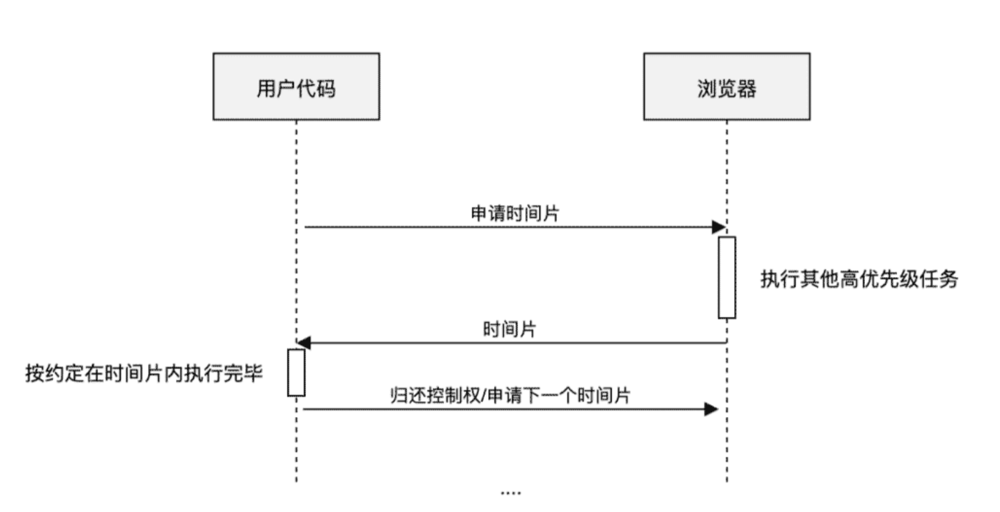

# React Fiber
> React渲染的过程可以被中断，可以将控制权交回浏览器，让位给高优先级的任务，浏览器空闲后再恢复渲染。

### 1.主动让出机制
> 由浏览器给我们分配执行时间片  

### 2.requestIdleCallback API
> window.requestIdleCallback()方法将在浏览器的空闲时段内调用的函数排队。这使开发者能够在主事件循环上执行后台和低优先级工作，而不会影响延迟关键事件
