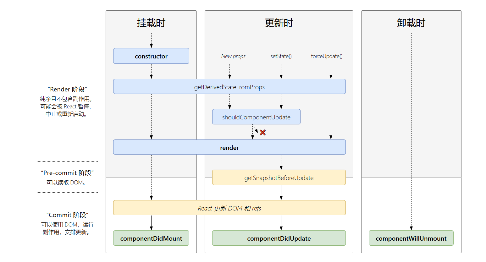
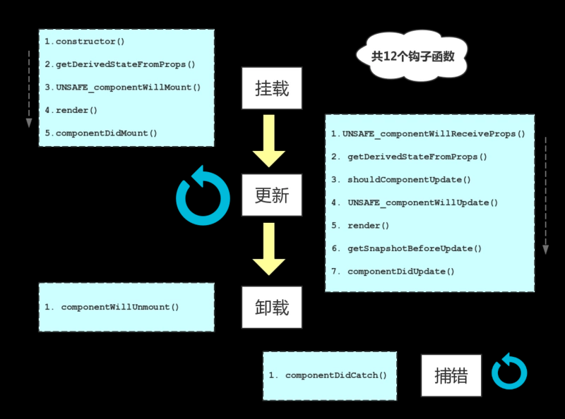

# 生命周期
    
  

## 三个状态
- Mounting:挂载，插入真实DOM
- Updating:更新，正在被重新渲染
- Unmounting:卸载，已移出真实DOM
## 五种处理函数
will函数在进入状态之前调用，did函数在进入状态后调用
- componentWillMount():在组件挂载到DOM前调用，且只会被调用一次，在这边调用this.setState不会引起组件重新渲染，也可以把写在这边的内容提前到constructor(),所以在项目中很少用。
- componentDidMount():在安装组件(插入树中)后立即调用，需要DOM节点的初始化应该放在这里。
```
class Hello extend React.Component{
    constructor(props){
        super(props)
        this.state={opacity:1.0};
    }

    componentDidMount(){
        this.timer = setInterval(function(){
            var opacity = this.state.opacity;
            opacity -= .05;
            if(opacity<0.1){
                opacity=1.0;
            }
            this.setState({
                opacity:opacity
            });
        }.bind(this),100);
    }

    render(){
        return (
            <div style={{opacity:this.state.opacity}}>
            Hello {this.props.name}
            </div>
        );
    }
}

ReactDOM.render(
    <Hello name="world"/>,
    document.getElementById('example')
);
```
- componentWillUpdate(object nextProps,object nextState)
- componentDidUpdate(object prevProps,object prevState)：更新发生后立即调用，初始渲染不会调用此方法。
```
componentDidUpdate(prevProps){
    if(this.props.userID !== preProps.userID){
        this.fetchData(this.props.userID);
    }
}
```
- componentWillUnmount():在卸载和销毁组件之前立即调用，在此方法中执行任何必须的清理，例如使计时器无效，取消网络请求或清除在其中创建的任何订阅componentDidMount()
## 两种特殊状态的处理函数
- componentWillReceiveProps(object nextProps):已加载组件收到新的参数时调用
- shouldComponentUpdate(object nextProps,object nextState):组件判断是否重新渲染时调用

## constructor
1. 用于初始化内部状态，很少使用
2. 唯一可以直接修改state的地方
## getDerivedStateFromProps
1. 当state需要从props初始化时使用
2. 尽量不要使用：维护两者状态一致性会增加复杂度
3. 每次render都会调用
4. 典型场景：表单控件获取默认值
## componentDidMount
1. UI渲染完成后调用
2. 只执行一次
3. 典型场景：获取外部资源
## componentWillUnmount
1. 组件移除时被调用
2. 典型场景：资源释放
## getSnapshotBeforeUpdate
1. 在页面render之前调用，state已更新
2. 典型场景：获取render之前的DOM状态
## componentDidUpdate
1. 每次UI更新时被调用
2. 典型场景：页面需要根据props变化重新获取数据
## shouldComponentUpdate
1. 决定Virtual DOM是否要重绘
2. 一般可以由PureComponent自动实现
3. 典型场景：性能优化

## demo
```
<script type="text/babel">
    class Life extends React.Component{
        // 1）初始化阶段
        constructor(props){
            super(props);
            console.log('constructor(props)');
            this.state = {
                age: 1
            }
        }

        componentWillMount(){
            console.log('componentWillMount');
        }

        render(){
            console.log('render()');
            return (
                <div>
                    <h2>我是树妖，今年{this.state.age}岁了！</h2>
                    <button
                        onClick={()=>ReactDOM.unmountComponentAtNode(document.getElementById('app'))}>
                        我被砍了
                    </button>
                </div>
            )
        }

        componentDidMount(){
            console.log('componentDidMount');
            // 开启定时器
            this.intervalId = setInterval(()=>{
                 console.log('定时器在工作了');
                 // 更新状态
                this.setState({
                    age: this.state.age + 1
                })
            }, 1000);
        }

        // 2) 更新阶段
        componentWillUpdate(){
            console.log('componentWillUpdate()');
        }

        componentDidUpdate(){
            console.log('componentDidUpdate()');
        }

        // 3) 卸载阶段
        componentWillUnmount(){
            console.log('componentWillUnmount()');
            // 清除定时器
            clearInterval(this.intervalId);
        }

        // 4) 错误处理
        componentDidCatch(){
            console.log('componentDidCatch()');
        }
    }
    ReactDOM.render(<Life/>, document.getElementById('app'));
</script>
```