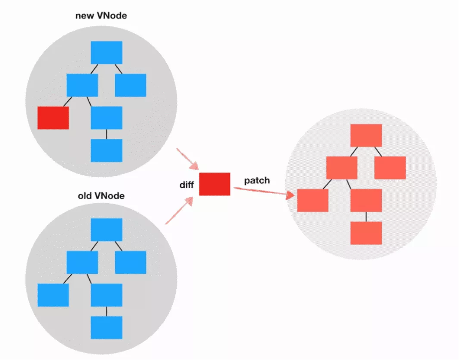

# 从Preact中了解React组件和hooks基本原理
## Virtual-DOM
  

Virtual-DOM其实就是一颗对象树，这个对象树最终要映射到图形对象。  

Virtual-DOM比较核心的是它的**diff算法**  

可以想象这里有个**DOM映射器**  

DOM映射器的工作就是将Virtual-DOM对象树映射浏览器页面的DOM，只不过为了提高DOM的‘操作性能’。它不是每一次都全量渲染整个Virtual-DOM树，而是支持接收两颗Virtual-DOM对象树(一个更新前，一个更新后)，通过diff算法计算出两颗Virtual-DOM树差异的地方，然后只应用这些差异的地方到实际的DOM树，从而减少DOM变更的成本。  

Virtual-DOM更大的意义在于开发方式的改变：声明式、数据驱动，然开发者不需要关心DOM的操作细节(属性操作、事件绑定、DOM节点变更)，也就是应用的开发方式变成了**view=f(state)**  

## 从createElement开始
**createElement不过就是构造一个对象(VNode)**

## Component的实现
**组件是一个自定义的元素类型，可以声明组件的输入(props)、有自己的生命周期和状态以及方法、最终输出Virtual-DOM对象树，作为应用Virtual-DOM树的一个分支存在**