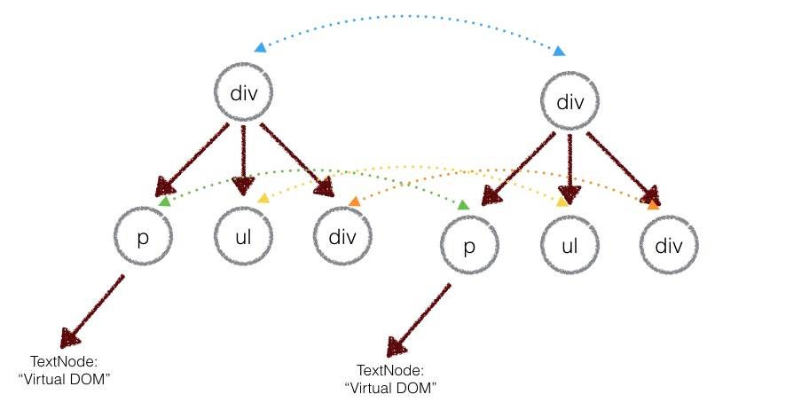
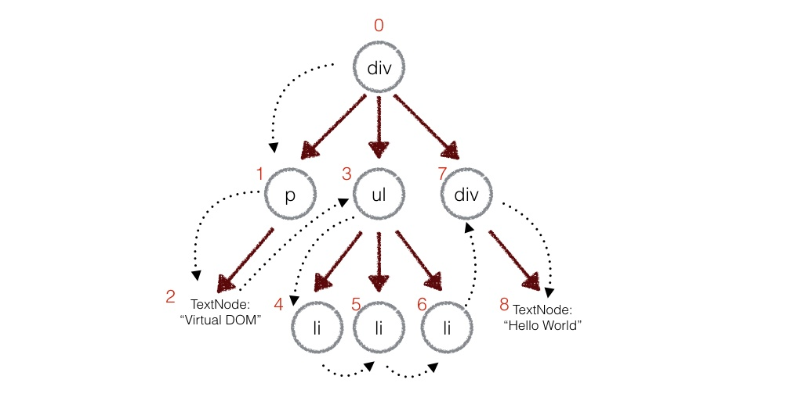

# 虚拟DOM
### 虚拟DOM算法
1. 用JS对象结构表示DOM树的结构；然后用这个树构建一个真正的DOM树，插到文档中
2. 当状态变更的时候，重新构造一棵新的对象树。然后用新的对象树和旧树对比，记录差异
3. 把2所记录的差异应用到步骤1所构建的真正的DOM树上，视图就更新了  

**Virtual DOM本质上就是在JS和DOM之间做了一个缓存**

### 算法实现
#### 1. 用JS对象模拟DOM树

```
//element.js
function Element (tarName,props,children){
    this.tagName = tarName;
    this.props = props;
    this.children = children;
}

module.exports = function (tagName,props,children){
    return new Element(tagName,props,children)
}

//应用,DOM结构
let el = require('./element');

let ul = el('ul',{id:'list'},[
    el('li', {class: 'item'}, ['Item 1']),
    el('li', {class: 'item'}, ['Item 2']),
    el('li', {class: 'item'}, ['Item 3'])
])

//构建真正的ul
Element.prototype.render = function () {
    let el = document.createElement(this.tagName);//根据tagName构建
    let props = this.props;

    for(let propName in props){
        //设置节点的DOM属性
        let propValue = props[propName];
        el.setAttribute(propName,propValue);
    }

    let children = this.children || [];

    children.forEach(function(child){
        let childEl = (child instanceof Element)
                    ? child.render() //如果子节点也是虚拟DOM，递归构建DOM节点
                    : document.createTextNode(child) //如果字符串，只构建文本节点
        el.appendChild(childEl);
    })

    return el;
}


let ulRoot = ul.render();
document.body.appendChild(ulRoot);


//结果
<ul id='list'>
  <li class='item'>Item 1</li>
  <li class='item'>Item 2</li>
  <li class='item'>Item 3</li>
</ul>
```

#### 2. 比较两棵虚拟DOM树的差异  

Virtual DOM只会对同一层级的元素进行比较：  

  

- 深度优先遍历，记录差异  

  

在深度优先遍历的时候，每遍历到一个节点就把该节点和新的树进行比较。如果有差异的话就记录到一个对象里面  

```
//diff函数，对比两棵树
function diff(oldTree,newTree){
    let index = 0;//当前节点的标识
    let patches = {};//用来记录每个节点差异的对象
    dfsWalk(oldTree,newTree,index,patches);
    return patches;
}

//对两棵树进行深度优先遍历
function dfsWalk(oldTree,newTree,index,patches){
    //对比oldNode和newNode的不同，记录下来
    patches[index] = [...]

    diffChildren(oldTree.children,newTree.children,index,patches)
}

//遍历子节点
function diffChildren(oldChildren, newChildren,index,patches){
    let leftNode = null;
    let currentNodeIndex = index;
    oldChildren.forEach(function(child,i){
        let newChild = newChildren[i];
        currentNodeIndex = (leftNode && leftNode.count) //计算节点的标识
                            ? currentNodeIndex + leftNode.count + 1
                            : currentNodeIndex + 1
        dfsWalk(child,newChild,currentNodeIndex,patches)//深度遍历子节点
        leftNode = child
    })
}
```

- 差异类型  

1. 替换掉原来的节点，如把div换成section
2. 移动、删除、新增子节点
3. 修改节点的属性
4. 文本内容的修改  

#### 3.把差异应用到真正的DOM树上
深度遍历真正的DOM树，然后从步骤二中的patches对象中找出差异进行DOM操作  

```
function path(node,patches){
    let walker = {index:0};
    dfsWalk(node,walker,patches)
}

function dfsWalk(node,walker,pathes){
    let currentPatches = patches[walker.index];//从patches拿出当前节点的差异

    let len = node.childNodes ? node.childNodes.length : 0;

    for(let i = 0;i<len;i++){
        //深度遍历子节点
        let child = node.childNodes[i];
        walker.index++;
        dfsWalk(child,walker,patches);
    }

    if(currentPatches){
        applyPatches(node,currentPatches);//对当前节点进行DOM操作
    }
}

//applyPatches，根据不同类型的差异对当前节点进行 DOM 操作：

function applyPatches (node, currentPatches) {
  currentPatches.forEach(function (currentPatch) {
    switch (currentPatch.type) {
      case REPLACE:
        node.parentNode.replaceChild(currentPatch.node.render(), node)
        break
      case REORDER:
        reorderChildren(node, currentPatch.moves)
        break
      case PROPS:
        setProps(node, currentPatch.props)
        break
      case TEXT:
        node.textContent = currentPatch.content
        break
      default:
        throw new Error('Unknown patch type ' + currentPatch.type)
    }
  })
}
```

### 总结
```
// 1. 构建虚拟DOM
var tree = el('div', {'id': 'container'}, [
    el('h1', {style: 'color: blue'}, ['simple virtal dom']),
    el('p', ['Hello, virtual-dom']),
    el('ul', [el('li')])
])

// 2. 通过虚拟DOM构建真正的DOM
var root = tree.render()
document.body.appendChild(root)

// 3. 生成新的虚拟DOM
var newTree = el('div', {'id': 'container'}, [
    el('h1', {style: 'color: red'}, ['simple virtal dom']),
    el('p', ['Hello, virtual-dom']),
    el('ul', [el('li'), el('li')])
])

// 4. 比较两棵虚拟DOM树的不同
var patches = diff(tree, newTree)

// 5. 在真正的DOM元素上应用变更
patch(root, patches)
```