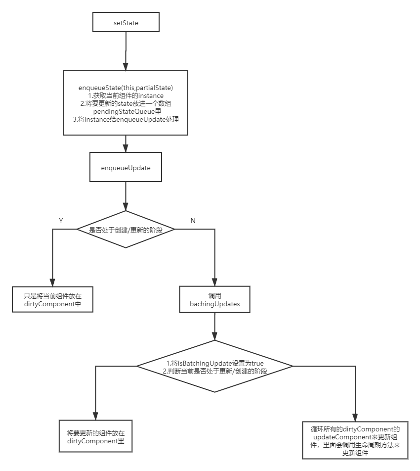

# setState机制
## 1.setState异步更新
> setState通过一个**队列机制**实现state更新。当执行setState时，会将需要更新的state合并后放入状态队列，而不会立刻更新this.state，队列机制可以高效地批量更新state。在使用setState改变状态之后，立刻通过this.state去拿最新的状态往往是拿不到的。  

### 使用要点
- 需要基于最新的state做业务，在componentDidUpdate或setState的回调函数里获取  

```
changeTitle:function(event){
    this.setState({
        title:event.target.value
    },() => this.APICallFunction());
},
APICallFunction:function(){
    //Call API with the updated value
}
```

- 下一个state依赖前一个state,给setState传function

```
onClick = () => {
    this.setState((prevState,props) => {
        return {
            quantity:prevState.quantity + 1
        }
    });
    this.setState((prevState,props) => {
        return {
            quantity:prevState.quantity + 1
        }
    })
}
```



### 一、setState
```
ReactComponent.prototype.setState = function (partialState,callback) {
    //将setState事务放进队列中
    this.updater.enqueueSetState(this,partialState);
    if(callback) {
        this.updater.enqueueCallback(this,callback,'setState');
    }
}
```

### 二、enqueueSetState

```
enqueueSetState:function(publicInstance,partialState) {
    //获取当前组件的instance
    let internalInstance = getInternalInstanceReadyForUpdate(publicInstance,'setState');
    //将要更新的state放入一个数组里
    let queue = internalInstance._pendingStateQueue || (internalInstance._pendingStateQueue = []);
    queue.push(partialState);
    //将要更新的component instance也放在一个队列里
    //用enqueueUpdate来处理将要更新的实例对象
    enqueueUpdate(internalInstance);
}
```

### 三、enqueueUpdate
```
function enqueueUpdate(component) {
    //如果没有处于批量创建/更新组件的阶段，则处理update state事务
    if(!batchingStrategy.isBatchingUpdates) {
        batchingStrategy.batchedUpdate(enqueueUpdate,component);
        return;
    }
    //如果正处于批量创建/更新组件的过程，将当前的组件放在dirtyComponents数组中
    dirtyComponents.push(component);
}
```

### 四、batchingStrategy

```
let ReactDefaultBatchingStrategy = {
    //用于标记当前是否出于批量更新
    isBatchingUpdates:false,
    //当调用这个方法时，正式开始批量更新
    batchedUpdates:function (callback,a,b,c,d,e) {
        var alreadyBatchingUpdates = ReactDefaultBatchingStrategy.isBatchingUpdates;

        ReactDefaultBatchingStrategy.isBatchingUpdates = true;

        // 如果当前事务正在更新过程在中，则调用callback，既enqueueUpdate
        if (alreadyBatchingUpdates) {
        return callback(a, b, c, d, e);
        } else {
        // 否则执行更新事务
        return transaction.perform(callback, null, a, b, c, d, e);
        }
    }
}
```

### 五、transaction