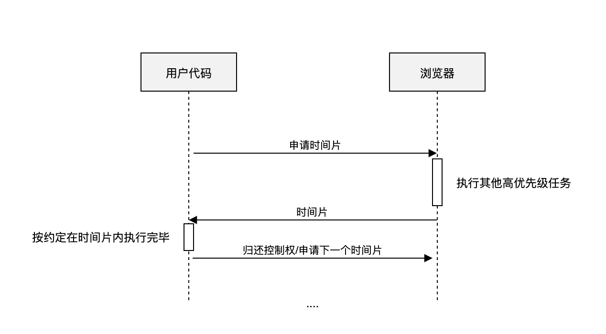
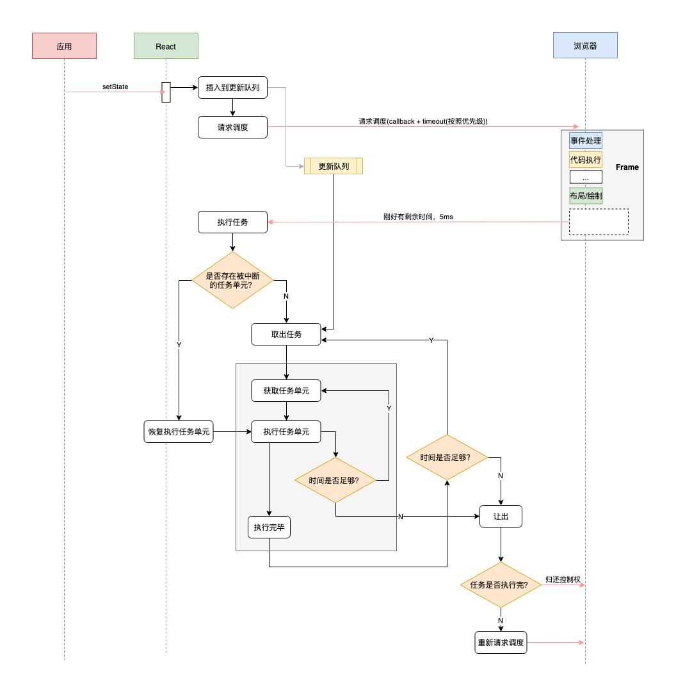

# React Fiber(时间切片)
JS是**单线程运行**的，当前面有一个任务长期占用CPU时，会阻塞后面的任务，使得浏览器卡死。  

解决的这个问题的方向：  
1. 优化每个任务，让它有多快就多快，挤压CPU运算量(Vue)
2. 快速响应用户，让用户觉得够快，不能阻塞用户的交互(React)
3. 尝试Worker多线程  

> React渲染资源时，会递归对比VirtualDOM树，找出需要变动的节点，然后同步更新它们。这个过程称为**Reconcilation**(协调)。   
> 为了给用户制造一种应用很快的“假象”，不能让一个程序长期霸占着资源，可以将浏览器的渲染、布局、绘制、资源加载(例如HTML解析)、事件响应、脚本执行视作操作系统的‘进程’，我们需要通过某些调度策略合理分配CPU资源，从而提高浏览器的用户响应速率，同时兼顾任务执行效率。  

> React通过**Fiber架构**，让自己的Reconcilation过程变成可被中断。  

- 适时让出CPU执行权，可以让浏览器及时响应用户的交互
- 与其一次性大量DOM节点相比，分批延时对DOM进行操作，可以得到更好的用户体验
- 给浏览器一点喘息的机会，它会对代码进行编译优化(JIT)及进行热代码优化，或对reflow进行修正

## 何为Fiber
### 1.一种流程控制原语
Fiber也称**协程**，使得渲染过程可以被中断，可以将控制权交回浏览器，让位给高优先级的任务，浏览器空闲后再恢复渲染

类似generator的作用  

普通函数执行过程无法被**中断和恢复**  

```
const tasks = [];
function run() {
    let task;
    while(task = tasks.shift()){
        execute(task)
    }
}
```

Generator可以

```
const tasks = []
function *run() {
    let task

    while(task = tasks.shift()){
        //判断是否有高优先级事件需要处理，有的话让出控制权
        if(hasHighPriorityEvent()){
            yield
        }

        //处理完高优先级事件后，恢复函数调用栈，继续执行
        execute(task)
    }
}
```

#### 浏览器没有抢占的条件，所以React只能用让出机制
> 一是浏览器中没有类似进程的概念，‘任务’之间的界限很模糊，没有上下文，所以不具备中断/恢复的条件。二是没有抢占的机制，无法中断一个正在执行的程序  



#### 怎么确定有高优先级任务要处理，即什么时候让出
**通过超时检查的机制来让出控制权**  

> 确定一个合理的运行时长，然后在合适的检查点检查是否超时(比如每执行一个小任务)，如果超时就停止执行，将控制权交换给浏览器     

比如为了让视图流畅地运行，可以按照人类能感知到最低限度每秒60帧的频率划分时间片，这样每个时间片就是16ms

- 浏览器提供了相关的接口-----requestIdleCallback  

> 浏览器是一帧一帧执行的，在两个执行帧之间，主线程通常会有一小段空闲时间，requestIdleCallback可以在这个空闲期(Idle Period)调用空闲期回调(Idle Callback),执行一些任务

### 2.一个执行单元
Fiber的另外一种解读是‘纤维’，将它视作一个执行单元，每次执行完一个‘执行单元’，React就会检查现在还剩多少时间，如果没有时间就将控制权让出去  

  
