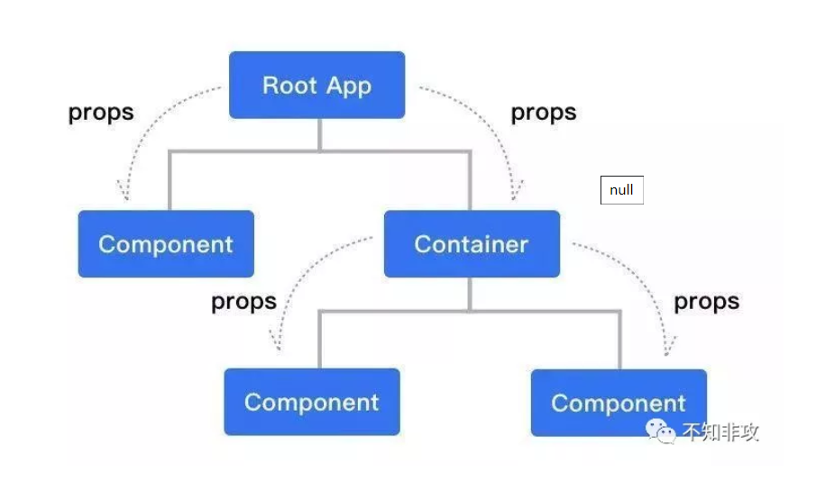

# useState
## 单向数据流
  

在React中，**state与props的改变，都会引发组件重新渲染**。如果是父组件的变化，则父组件下所有子组件都会重新渲染。  

- class组件中，组件重新渲染，是执行render方法  

- 函数式组件中，是整个函数重新执行

## 函数式组件
函数式组件与普通的函数几乎完全一样。只不过函数执行完毕时，**返回的是一个JSX结构**。

```
function Hello(){
    return <div>hello world</div>
}
```
### 1.函数式组件接收props作为自己的参数
```
import React from 'react';

interface Props{
    name:string,
    age:number
}

function Demo({name,age}:Props){
    return [
        <div>name:{name}</div>
        <div>age:{age}</div>
    ]
}

export default Demo;
```
### 2.props的每次变动，组件都会重新渲染一次，函数重新执行
### 3.没有this

## Hooks
**有状态的函数式组件**

### useState
每次渲染，函数都会重新执行  

每当函数执行完毕，所有的内存都会被释放掉  

**useState利用闭包，在函数内部创建一个当前函数组件的状态。并提供一个修改该状态的方法**

```
import React,{useState} from 'react';

export default function Counter(){
    //利用数组解构的方式接收状态名及其设置方法
    //传入0作为状态counter的初始值
    const [counter,setCounter] = useState(0);

    return [
        <div key="a">{counter}</div>,
        <button key="b" onClick={()=>setCounter(counter + 1)}>点击+1</button>
    ]
}
```
**useState接收一个值作为当前定义的state的初始值。并且初始操作只有组件首次渲染才会执行。**

```
// 首次执行，counter初始值为10
// 再次执行，因为在后面因为某种操作改变了counter，则获取到的便不再是初始值，而是闭包中的缓存值
const [counter, setCounter] = useState(10);
setCounter(20);
```
如果初始值需要通过较为复杂的计算得出，则可以传入一个函数作为参数，函数返回值为初始值。该函数也只会在组件首次渲染时执行一次。

```
const a = 10;
const b = 20

// 初始值为a、b计算之和
const [counter, setCounter] = useState(() => {
  return a + b;
})
```

## 实战
多个滑动条控制div元素的不同属性  

```
import React, { useState } from 'react';
import { Slider } from 'antd-mobile';
import './index.scss';

interface Color {
  r: number,
  g: number,
  b: number
}

export default function Rectangle() {
  const [height, setHeight] = useState(10);
  const [width, setWidth] = useState(10);
  const [color, setColor] = useState<Color>({ r: 0, g: 0, b: 0 });
  const [radius, setRadius] = useState<number>(0);

  const style = {
    height: `${height}px`,
    width: `${width}px`,
    backgroundColor: `rgb(${color.r}, ${color.g}, ${color.b})`,
    borderRadius: `${radius}px`
  }

  return (
    <div className="container">
      <p>height:</p>
      <Slider
        max={300}
        min={10}
        onChange={(n) => setHeight(n || 0)}
      />
      <p>width:</p>
      <Slider
        max={300}
        min={10}
        onChange={(n) => setWidth(n || 0)}
      />

      <p>color: R:</p>
      <Slider
        max={255}
        min={0}
        onChange={(n = 0) => setColor({ ...color, r: n })}
      />

      <p>color: G:</p>
      <Slider
        max={255}
        min={0}
        onChange={(n = 0) => setColor({ ...color, g: n })}
      />

      <p>color: B:</p>
      <Slider
        max={255}
        min={0}
        onChange={(n = 0) => setColor({ ...color, b: n })}
      />
      <p>Radius:</p>
      <Slider
        max={150}
        min={0}
        onChange={(n = 0) => setRadius(n)}
      />
      <div className="reatangle" style={style} />
    </div>
  )
}
```

## 异步
**无论是在class中，还是hooks中，state的改变，都是异步的**

```
const [counter, setCounter] = useState(10);
setCounter(20);
console.log(counter);  // 此时counter的值，并不是20，而是10
```

## 利用接口请求数据
```
import React, { useState } from 'react';

interface ListItem {
  name: string,
  id: number,
  thumb: string
}

// 一堆各种参数
interface Param {
  current?: number,
  pageSize?: number,
  name?: string,
  id?: number,
  time?: Date
}

export default function AsyncDemo() {
  const [listData, setListData] = useState<ListItem[]>([]);

  // 定义一个状态缓存参数，确保每次改变后都能缓存完整的参数
  const [param, setParam] = useState<Param>({});

  function fetchListData() {
    // @ts-ignore
    listApi(param).then(res => {
      setListData(res.data);
    })
  }

  function searchByName(name: string) {
    setParam({ ...param, name });
    // 改变param之后立即执行请求数据的代码
    // 这里的问题是，因为异步的原因，param并不会马上发生变化，
    // 此时直接发送请求无法拿到最新的参数
    fetchListData();
  }

  return [
    <div>data list</div>,
    <button onClick={() => searchByName('Jone')}>search by name</button>
  ]
}
```
**什么样的变量适合使用useState去定义**？

当然是能够直接影响DOM的变量，这样我们才会将其称之为状态。  

因此param这个变量对于DOM而言没有影响，此时将他定义为一个异步变量并不明智。好的方式是将其定义为一个同步变量。

```

export default function AsyncDemo() {
  const [listData, setListData] = useState<ListItem[]>([]);

  // 定义为同步变量
  let param: Param = {}

  function fetchListData() {
    // @ts-ignore
    listApi(param).then(res => {
      setListData(res.data);
    })
  }

  function searchByName(name: string) {
    param = { ...param, name };
    fetchListData();
  }

  return [
    <div>data list</div>,
    <button onClick={() => searchByName('Jone')}>search by name</button>
  ]
}
```
函数式组件的特性吗？每次状态改变，函数都会重新执行一次，那么此时param也就被重置了。状态无法得到缓存。  
每一个模块，都是一个执行上下文。因此，我们只要在这个模块中定义一个变量，并且在函数组件中访问，那么闭包就有了。

因此，将变量定义到函数的外面。如下  

```
// 定义为同步变量
let param: Param = {}

export default function AsyncDemo() {
  const [listData, setListData] = useState<ListItem[]>([]);

  function fetchListData() {
    // @ts-ignore
    listApi(param).then(res => {
      setListData(res.data);
    })
  }

  function searchByName(name: string) {
    param = { ...param, name };
    fetchListData();
  }

  return [
    <div>data list</div>,
    <button onClick={() => searchByName('Jone')}>search by name</button>
  ]
}
```
这个闭包中的变量，即使在组件被销毁了，它的值还会存在。当新的组件实例被渲染，param就无法得到初始值了。  
**useState其实也是利用闭包缓存了状态，并且即使函数多次执行，也只会初始化一次**。  

```
export default function AsyncDemo() {
  const [param] = useState<Param>({});
  const [listData, setListData] = useState<ListItem[]>([]);

  function fetchListData() {
    // @ts-ignore
    listApi(param).then(res => {
      setListData(res.data);
    })
  }

  function searchByName(name: string) {
    param.name = name;
    fetchListData();
  }

  return [
    <div>data list</div>,
    <button onClick={() => searchByName('Jone')}>search by name</button>
  ]
}
```